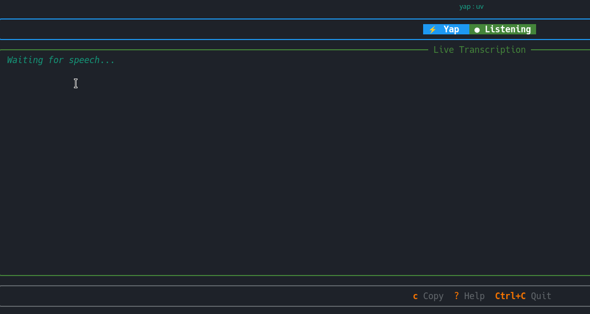
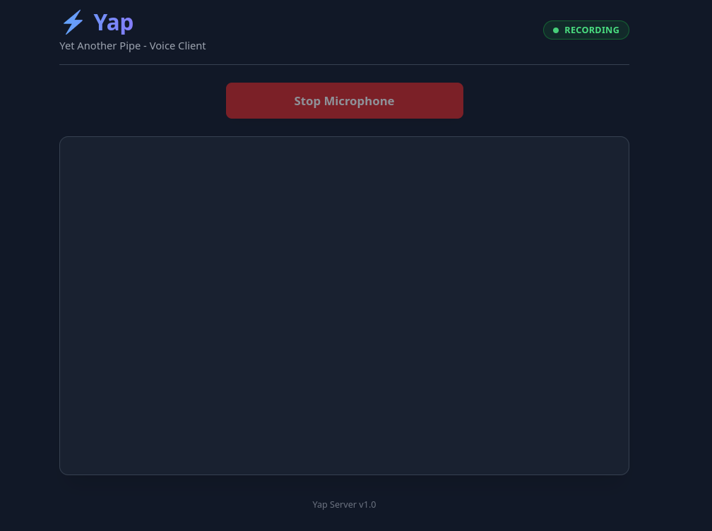

# YAP - Yet Another P|PE: Fast Voice-to-Text


A high-performance, local voice-to-text system using `faster-whisper`. Designed for **low latency**, **hardware flexibility**, and **production readiness**.

## Table of Contents

- [Features](#features)
- [Architecture](#architecture)
- [Installation](#installation)
- [Quick Start](#quick-start)
- [Configuration](#configuration)
- [Usage](#usage)
- [Development](#development)
- [Contributing](#contributing)
- [License](#license)

## Features

- **Split Architecture**: Client/Server design decoupled via WebSockets. Run the heavy inference server on a powerful machine (or background process) and the lightweight client anywhere.
- **Auto-Daemon**: The client automatically starts the server in the background if it's not running. No need to manually manage processes.
- **Hardware Optimized**:
    - **Intelligent Device Selection**: Auto-detects preferred input devices (e.g., C920 Webcam) specified in config.
    - **ALSA Error Suppression**: Clean console output by suppressing noisy low-level audio driver errors.
- **Production Ready**: Integrated Voice Activity Detection (VAD) to filter silence, robust error handling, and reconnection logic.
- **Hot-Reload Config**: Edit `app.yaml` and changes (like model size or input device) apply instantly without restarting.

## Architecture

The system consists of two main components:

1.  **Client (`src/yap/client`)**: Lightweight. Captures audio using `PyAudio`, handles device selection, downsampling, and streams raw PCM to the server via WebSockets.
2.  **Server (`src/yap/server`)**: Heavy. Runs `faster-whisper` model. Accepts audio streams, performs VAD, and executes inference.

See `docs/architecture.md` for a detailed architectural overview.
For the full WebSocket protocol specification, see [`docs/asyncapi.yaml`](docs/asyncapi.yaml).

## Installation

### Prerequisites

- Python 3.11 or higher
- `uv` (recommended) or `pip`
- `ffmpeg` installed on your system

### Steps

1.  **Clone the repository**:
    ```bash
    git clone https://github.com/your-username/fast-voice.git
    cd fast-voice
    ```

2.  **Install dependencies**:
    ```bash
    uv pip install -e .
    ```

## Quick Start
### 1. Running the Example (Easiest)
Run the "Cowsay" example to see it in action:
```bash
uv run examples/cowsay_app.py
```
This will:
1.  **Auto-start** the `yap-server` daemon if needed.
2.  Record audio for 10 seconds.
3.  Display the transcript spoken by a cow.

### 2. Visual Client (Recommended)
For a premium terminal experience with live scrolling and status indicators:



```bash
uv run yap
```
- **Live Updates**: See text appear instantly.
- **Shortcuts**: Press `c` to copy, `?` for help.
- **Clean Output**: Pipes only final text to stdout on exit.

### 3. Web Client (Microphone In Browser)
Run the speech recognition entirely in your browser without any terminal client.



1.  **Start the Server**:
    ```bash
    uv run yap-server
    ```
2.  **Open the WebUI**:
    ```bash
    uv run yap-web
    ```
3.  **Start Speaking**:
    Click **"Start Microphone"**, allow permissions, and your speech will be transcribed instantly.

## Configuration

The application is configured via `app.yaml`.

- **Audio Input**: Select specific device index or use "default".
- **Model**: Choose `tiny`, `small`, `medium`, or `large-v3`.
- **Compute**: Use `int8` (CPU friendly) or `float16` (GPU).
- **VAD**: Enable/Disable Voice Activity Detection.
- **Server**: Configure host and port.

Example `app.yaml`:
```yaml
audio:
  input_device: default
  sample_rate: 16000

model:
  size: small
  compute_type: int8

server:
  host: 0.0.0.0
  port: 9090
```

## Usage

### Manual Server (Optional)
If you prefer to run the server manually (e.g., for debugging logs):
```bash
uv run yap-server
```

### Using the Client API
Build your own voice-controlled apps easily:
```python
import asyncio
from yap.client.core import VoiceClient

async def main():
    client = VoiceClient()
    
    # Callback for when text is finalized
    def on_transcribed(text):
        print(f"You said: {text}")

    # Run for 10 seconds (or indefinitely with a loop/event)
    await client.run(duration=10, on_transcription=on_transcribed)

if __name__ == "__main__":
    asyncio.run(main())
```

### Remote Server (SSH Tunneling)
You can run the heavy `yap-server` on a powerful remote machine (e.g., a GPU server) and the lightweight TUI on your local laptop.

1.  **On the Remote Server**:
    Start the server:
    ```bash
    uv run yap-server
    ```

2.  **On Your Local Machine**:
    Create an SSH tunnel forwarding local port 9090 to the remote server's port 9090:
    ```bash
    ssh -L 9090:localhost:9090 user@remote-ip
    ```

3.  **Run the Local Client**:
    ```bash
    uv run yap
    ```
    The client will connect to `localhost:9090`, which is securely tunneled to your remote server.

## Development

### Running Tests
The project includes a robust testing SDK for headless environments.

**Automated E2E Test**:
Verifies the full pipeline (Client -> Network -> Server -> Whisper) without a microphone.
```bash
uv run python -m unittest tests/test_e2e.py
```

**Unit Tests**:
```bash
uv run python -m unittest tests/test_client.py
```

### Simulation Client
Use the simulation client to test with synthetic audio or WAV files:
```python
from yap.testing import SimulationClient

# 1. Use built-in synthetic voice
client = SimulationClient()

# 2. Or stream a custom WAV file
# client = SimulationClient(audio_file="speech.wav")

await client.run(duration=5)
```

## Contributing

We welcome contributions! Please see [CONTRIBUTING.md](CONTRIBUTING.md) for details on how to get started.

## License

This project is licensed under the MIT License - see the [LICENSE](LICENSE) file for details.
