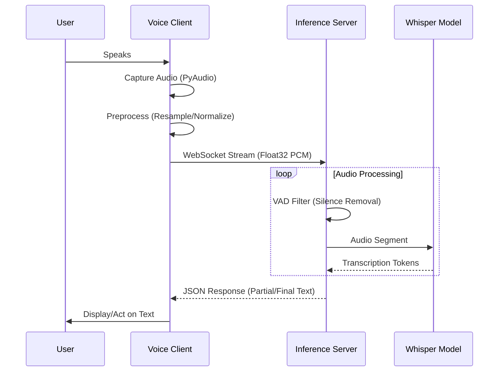

# Fast Voice-to-Text Architecture

## Overview

Fast Voice-to-Text is a split-architecture system designed for **low-latency**, **high-fidelity** speech recognition using `faster-whisper`. It decouples the heavy inference engine (Server) from the lightweight audio capture (Client) via WebSockets, allowing for flexible deployment scenarios (e.g., lightweight edge device capturing audio, powerful server processing it).

## detailed Architecture

### System Context Diagram



## detailed Components

### 1. Client (`src/fast_voice/client`)
Responsible for audio acquisition and communication. Designed to be as thin as possible.

- **Audio Capture**: Utilizes `PyAudio` (PortAudio wrapper) to capture raw PCM data from the microphone.
- **Signal Processing**:
    - **Downmixing**: Converts Stereo (2 channel) to Mono (1 channel).
    - **Resampling**: Converts input sample rate (e.g., 44.1kHz or 48kHz) to the model's required 16kHz using `numpy` interpolation.
    - **Normalization**: Converts Int16 PCM to Float32 (-1.0 to 1.0) for the network and model.
- **Device Management**: Automatically iterates and selects preferred input devices (e.g., "C920", "USB Audio") based on configuration to avoid default device pitfalls.
- **Daemon Management**: Check if the server is running on the configured port. If not, spawns the server process automatically using `subprocess`.

### 2. Server (`src/fast_voice/server`)
The heavy lifter. Runs the neural network and manages client connections.

- **Protocol**: `aiohttp` WebSocket server.
- **Voice Activity Detection (VAD)**: inspects incoming audio frames. Only frames with detected speech are buffered for inference. This drastically reduces CPU/GPU usage during silence.
- **Inference Engine**:
    - **Model**: `faster-whisper` (CTranslate2 backend) for up to 4x speedup over OpenAI's implementation.
    - **Concurrency**: Process-safe handling of the model to ensure non-blocking operation during inference.

### 3. Shared Library (`src/fast_voice/whisper_live`)
- Legacy core logic adapted from the `whisper-live` project.
- Handles the complex logic of buffering streaming audio into the chunks required by the Transformer model.

## Data Flow

1.  **Input**: 16-bit PCM Audio @ 48kHz (Typical Microphone).
2.  **Client Processing**: Resampled to 16kHz, converted to Float32.
3.  **Transport**: Sent as raw bytes over WebSocket.
4.  **Server Buffering**: Audio is accumulated in a ring buffer.
5.  **VAD Check**: Silero VAD checks for speech probability.
6.  **Inference**:
    - If speech detected: Audio chunk passed to `faster-whisper`.
    - Encoder processes audio features.
    - Decoder generates tokens.
7.  **Output**: JSON packet `{ "text": "...", "final": boolean }` sent back to client.

## Configuration
Managed by `app.yaml` and loaded via `src/fast_voice/config.py`.

- **Hot Reloading**: The system watches `app.yaml` for changes and reloads critical parameters (like Model Size) dynamically where possible.

## Project Structure
```text
src/fast_voice/
├── client/          # Client-side logic (Audio, Network, TUI)
│   ├── core.py      # Main client class
│   └── tui.py       # Terminal User Interface
├── server/          # Server-side logic
│   ├── main.py      # Server entry point
│   └── static/      # Web-based monitor
├── whisper_live/    # Shared backend (VAD, Transcriber)
└── config.py        # Configuration Management
examples/            # Example implementations
tests/               # Unit and End-to-End tests
docs/                # Project Documentation
```
